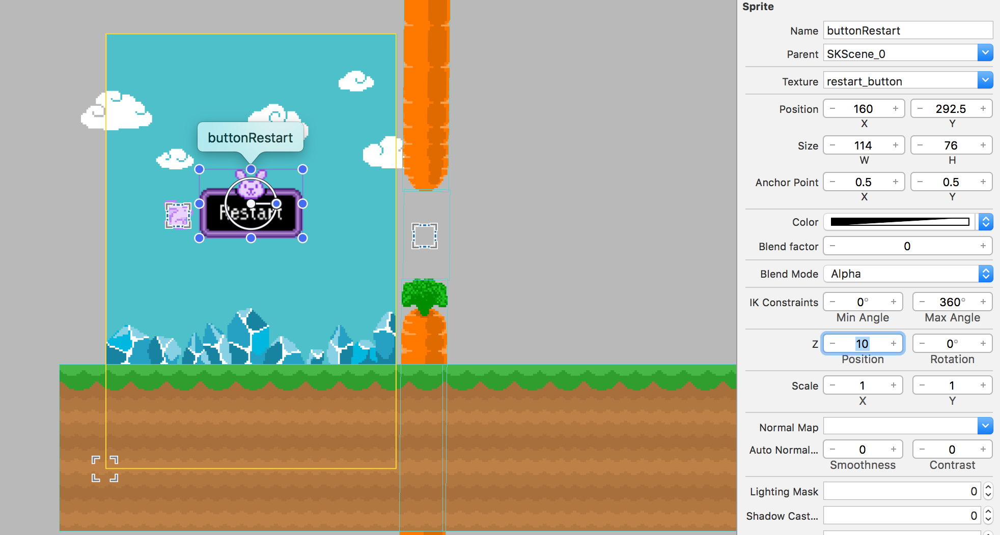
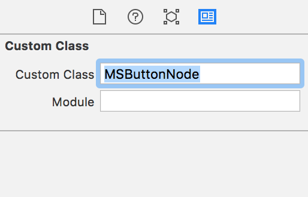

You are going to set up collision handling so that your game finally becomes as frustrating as *Flappy Bird*. Any good game needs to be unforgiving and frustrating, right?

I would recommend you have a look at Apple's own documentation on the subject of [Working with Collisions and Contacts.](https://developer.apple.com/library/ios/documentation/GraphicsAnimation/Conceptual/SpriteKit_PG/Physics/Physics.html#//apple_ref/doc/uid/TP40013043-CH6-SW14) It can be a little bit confusing when you first start, so don't worry if you don't understand
everything at once.

In our setup of collisions we are going to use the *Scene Editor* as much as possible to keep the code as lean as possible, in later tutorials we will expand on physics based collision setup in code.

#Obstacle physics

> [action]
> First, open *Obstacle.sks*, select either carrot.
> Enable physics by changing the *Body Type* to `Bounding rectangle` and untick the subsequent 4 boxes.
>
> 
>
> Next set the *Category Mask* to `2` and the *Contact Mask* to `1`, repeat this for the other carrot.
> Then modify the invisible goal sprite in the middle with one difference, set the *Category Mask* to `8`.
>

Every physics body in a scene can be assigned to up to 32 different categories, each corresponding to a bit in the 32 bit mask.
You notice those really big numbers, they are the integer value of `2` to the power `32` which represents every bit in the 32 bit mask being 1, this also means that that the body will collide with every other body and is the default behavior.

Think about separating your *Categories* into logical groups, for example:

- 1 - Player
- 2 - Obstacle
- 4 - Ground
- 8 - Goal Sensor

The *Contact Mask* allows us to define which physics bodies we want to be told about when a collision takes place.  This will be useful when the bunny hits the carrot, we don't want the bunny to bounce off the carrot we want the bunny to die at this point and fall from the sky.  We are setting the *Contact Mask* to `1` as we will be setting the *Category Mask* of the bunny to `1` very shortly.

The goal is a slightly different case, we want to be informed when the bunny has entered into the goal zone so we can increase our players
score.  However, we don't want the bunny to be physically hit by an invisible force field, we want the bunny to pass through as if nothing is there. We are effectively creating a *Sensor* a type of physics body that is used only for collision detection without physically affecting the body. We will come back to this in more detail soon.

#Bunny physics

> [action]
> Open up our *Hero.sks* and modify the bunny physics properties.
> Set the *Category Mask* to `1`, the *Collision Mask* to `4` and the *Contact Mask* to `4294967295` this is 2^32.
>
> 
>


The *Collision Mask* is set to `7` as we only want to collide with *Categories* `1+2+4`, we don't want to physically collide with `8` which is our goal sensor, otherwise the bunny will never be able to pass through the goal.  The *Contact Mask* has been set to 2^32  the max value and lets the physics engine know we want to be alerted if our bunny collides with any other physics body.

#Ground physics

We need to setup the ground sprite physics, do you think you can tackle this yourself? Check back if you don't remember the *Category Mask* value we decided to use.  What value do you think you'll need for the *Contact Mask?*

> [solution]
> Open up our *GameScene.sks* and modify the ground physics for both sprites.
> Set the *Category Mask* to `4` and the *Contact Mask* to `1`, we want to be informed if the bunny has hit the ground.
> 
>

Run your project, you should now collide with the obstacles yet be able to flap through the middle, if you're good enough :)

#Physics Collision Delegate

If the bunny collides with the ground, the obstacle or passes through the goal, we want to know about.  We will implement the Physics Contact Delegate so our code will be informed whenever one of these collisions takes place.

> [action]
> In *GameScene.swift* you need to declare that the *GameScene* class will implement (some of) the *SKPhysicsContactDelegate* protocol methods. You declare that a class is [implementing a protocol in Swift](https://developer.apple.com/library/ios/documentation/Swift/Conceptual/Swift_Programming_Language/Protocols.html) by appending *CKPhysicsContactDelegate* after the class' super class *SKScene*, separated by a comma, as follows:
>
```
class GameScene: SKScene, SKPhysicsContactDelegate {
```
>

The *GameScene* class is now ready to be used as a contact delegate.

> [action]
> You should assign *GameScene* as the collision delegate class by adding the following line (anywhere) to the `didMoveToView(..)` method:
>
```
/* Set physics contact delegate */
physicsWorld.contactDelegate = self
```

Finally, you can implement the contact handler method that will be called whenever a valid collision contact takes place.

> [action]
> Add this method to the *GameScene* class:
>
```
func didBeginContact(contact: SKPhysicsContact) {
  /* Hero touches anything, game over */
  print("TODO: Add contact code")
}
```
>

Publish and run the app in Xcode. Any time you collide with the ground, carrot or goal sensor the *TODO* message will be printed to the console.

#Implementing "game over"

Instead of only showing a message in the console, you surely want to implement a game over situation:

- Bunny falls to ground
- Screen rumbles
- Restart button appears
- Game restarts when restart button is pressed

##Adding a button

There is no easy way to add a button in SpriteKit so we will need to get creative and create our own solution.  To get started
with we have provided a custom class called *MSButtonNode*. Feel free to explore this class, it's well commented.

> [action]
>  and drag this file into your project.

<!-- -->

> [action]
> First, add the `restart_button` from the *Media library* to your scene.
> Next modify the properties of the button, set the *Name* to `buttonRestart` as we will want to create a code connection.
> Set the *Z Position* to `10`, we want to ensure this UI (User Interface) element sits on top of everything visually.
>
> 
>
> To turn this sprite into our custom button, we need to change the class to be an instance of `MSButtonNode` instead of `SKSpriteNode`, we can use the *Custom class* panel to change this:
>
> 
>

Can you setup a code connection for this button?

> [solution]
> Open *GameScene.swift* and add a property for the button to the *GameScene* class.
>
```
/* UI Connections */
var buttonRestart: MSButtonNode!
```
> Next, this is a bit tricker as we need to ensure the node is downcast to our `MSButtonNode` class.
> Add the following to the `didMoveToView(..)` method.
>
```
/* Set UI connections */
buttonRestart = self.childNodeWithName("buttonRestart") as! MSButtonNode
```
>

Now the button is connected, it would be a good idea to hide it while the bunny is hopping.

> [action]
> Add the following code after the previous connect code:
>
```
/* Hide restart button */
buttonRestart.state = .MSButtonNodeStateHidden
```
>


> [action]
> Now switch to Xcode and open *MainScene.swift*, then add this property at the top of the class:
>
>    weak var restartButton : CCButton!
>
> Next, extend the collision handling method to show the restart button:
>
>        func ccPhysicsCollisionBegin(pair: CCPhysicsCollisionPair!, hero: CCNode!, level: CCNode!) -> Bool {
>            restartButton.visible = true;
>            return true
>        }
>
> Lastly, implement the *restart* method that will be called when the restart button is pressed:
>
>        func restart() {
>            let scene = CCBReader.loadAsScene("MainScene")
>            CCDirector.sharedDirector().replaceScene(scene)
>        }

This method will reload the entire scene - restarting the game. Feel free to test this new functionality!

You will see that restarting the game works, but you don't have a real "game over" state yet. The scrolling goes on and there's no visualization of the game over situation.

> [action]
> Add a *gameOver* property at the beginning of the *MainScene* class, below or next to the other properties:
>
>       var gameOver = false
>
> Now add the new *triggerGameOver* method to *MainScene.swift*, ideally add it next to the *restart* method as they belong together:
>
>        func triggerGameOver() {
>            if (gameOver == false) {
>                gameOver = true
>                restartButton.visible = true
>                scrollSpeed = 0
>                hero.rotation = 90
>                hero.physicsBody.allowsRotation = false
>    
>                // just in case
>                hero.stopAllActions()
>    
>                let move = CCActionEaseBounceOut(action: CCActionMoveBy(duration: 0.2, position: ccp(0, 4)))
>                let moveBack = CCActionEaseBounceOut(action: move.reverse())
>                let shakeSequence = CCActionSequence(array: [move, moveBack])
>                runAction(shakeSequence)
>            }
>        }
>
> Then call this new method from the collision handler, instead of just making the restart button visible:
>
>        func ccPhysicsCollisionBegin(pair: CCPhysicsCollisionPair!, hero: CCNode!, level: CCNode!) -> Bool {
>            triggerGameOver()
>            return true
>        }
>
> You also need to update the *touchBegan* method to ensure that the user cannot "jump" when the game is over:
>
>        override func touchBegan(touch: CCTouch!, withEvent event: CCTouchEvent!) {
>            if (gameOver == false) {
>                hero.physicsBody.applyImpulse(ccp(0, 400))
>                hero.physicsBody.applyAngularImpulse(10000)
>                sinceTouch = 0
>            }
>        }

You should run your app again and test the game over sequence. There is only one last point left: the points!
