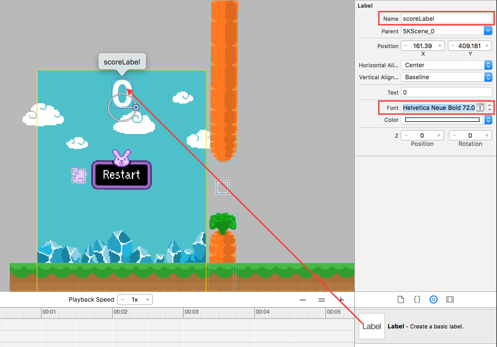

There is one thing missing, the player's score! It's not much fun dodging obstacles without any reward.

#Adding the score label

> [action]
> Drag a *Label* object into the *GameScene.sks*, set the *Name* to `scoreLabel` and set the font to something you like and will also be easy for the player to read.
> You could try `Helvetica Neue, Bold, 72`. Set the *Z Position* to `10` as you want to ensure it's always in the foreground.
>
> 
>
> Position it somewhere clear and easy to read, near top of the screen is good.
>

<!-- -->

> [info]
> If you are having difficulty moving the *scoreLabel* or just want finer control over node placement in general.
> You can use the *Arrow Keys* to move any node a pixel at a time or hold *Shift + Arrow Keys* to move in a bigger step.
>

Can you add a code connection in *GameScene.swift* for `scoreLabel`?
**Tip: The node type will be SKLabel**

> [solution]
> Open *GameScene.swift* and add the following property:
>
```
var scoreLabel: SKLabelNode!
```
>
> Add the following code after the `buttonRestart` connection:
>
```
scoreLabel = self.childNodeWithName("scoreLabel") as! SKLabelNode
```
>

Great the connection has been made, if you did it yourself, virtual high five.

##Tracking score

The *scoreLabel* will display game score.  However, as it stands there is no way to track this, let's add a score counter.

> [action]
> Open *GameScene.swift* is open and add the following property to the *GameScene* class:
>
```
var points = 0
```
>

When the game starts you want to ensure the label is reset to `0`, let's make that happen.

> [action]
> Add the following code to the bottom of the `didMoveToView(...)` method:
>
```
/* Reset Score label */
scoreLabel.text = String(points)
```
>
> `String(...)` is great for converting a number quickly into a string representation. You will be reusing this snippet when it comes to updating the score.

The next part takes a little bit of extra work, as it stands if the bunny collides with anything it will trigger the death sequence. So you need some way of knowing if this was a collision between the **bunny** and the **goal**. One way would be to compare the *categoryMask* remember this list:

- 1 - Player
- 2 - Obstacle
- 4 - Ground
- 8 - Goal Sensor

However in this example you will be using the *name* of the node.

> [action]
> Open *GameScene.swift* and add this code to the start of the `didBeginContact(...)` method, before the `gameState` check.
>
```
/* Get references to bodies involved in collision */
let contactA:SKPhysicsBody = contact.bodyA
let contactB:SKPhysicsBody = contact.bodyB
>
/* Get references to the physics body parent nodes */
let nodeA = contactA.node!
let nodeB = contactB.node!
>
/* Did our hero pass through the 'goal'? */
if nodeA.name == "goal" || nodeB.name == "goal" {
>    
  /* Increment points */
  points += 1
>  
  /* Update score label */
  scoreLabel.text = String(points)
>  
  /* We can return now */
  return
}
```

When a collision takes place between two bodies the information is stored in a *SKPhysicsContact* object.  You can use this to find out more information about the collision, so first you grab a reference to the *SKPhysicsBodies*.  However, you may have a custom class with your own properties and want to access those, so you go up a level and get a reference to the parent node this body belongs.

With the reference to *SKSpriteNode* node you can check for the *Name* of `goal`. You can then update the players *points* and use that to update the **score label**.  Straight after that you *return* from the `didBeginContact(...)` method, otherwise the player will suffer a needless death.

Run the game... With a bit of skill you should be able to pass through the goal and get a point. You can always make the goal area bigger for testing :]

#Summary

Congratulations!  Now you should see the complete game previewed at the beginning of this tutorial.

In this chapter you learned to:

- Adding a *SKLabel*
- Manage the player score
- Identifying specific physics collisions

The next chapter is a recap of everything you have covered so far, well done.
